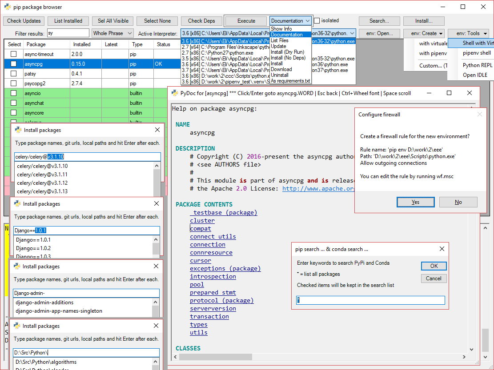

# pips
**pips** is a GUI for pip and conda - Python package manager, written in PowerShell.

This script helps to keep packages updated.

1. Hit Check for Updates
2. Choose packages
3. Select *Update* action and hit Execute

## features

- Dependency-free
- **pip** and **conda** are supported
- Looks up for installed Python distributions
- Filter and sort of packages
- Documentation viewer with simple highlighting and browser-like navigation
- Manage user virtualenv directories

## todo

- [ ] Add search with Github API
- [X] Add editable packages to Install dialog (git, local); pip list --editable
- [ ] Add some integration with VirusTotal (sha-256 of archive + link to VT for a starter)
- [ ] Fix "isolated" checkbox behavior is somewhat uncertain
- [ ] Move known package index builder code into the main script
- [ ] Sort by Popularity, Downloads, ...
- [ ] Add package name to JobName to prevent repeating requests already being queried
- [X] Filter modes: Whole, And, Or, Regexp
- [ ] Fix peps url 0000 numbering
- [X] Install packages dialog like in R Studio (with package name completion)
- [ ] PyDoc and PyPi meta-info mirror local indexing and searching
- [ ] Now assuming *utf-8* for IO whilst old(?) Python versions use cp1252, which generates empty strings for Chinese, Russian, etc.
- [ ] Filter package search results for conda by relevant Architecture
- [ ] Implement some missing conda commands
- [ ] *conda* command has a nice options to work with but gives wierd output - suggests older package versions than installed. Needed intervention with channels?
