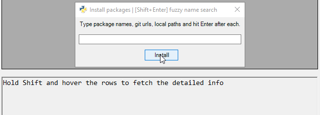

# pips


**pips** is a GUI for pip, github and conda - Python package browser, written in PowerShell.

This script helps to keep packages updated.


1. Hit Check for Updates
2. Choose packages
3. Select *Update* action and hit Execute


## features


- Dependency-free
- Search and install from **pip**, **conda** and **github**
- Looks up for all installed Python distributions
- Filter and sort packages
- View package dependecy tree
- Manage virtual environments
- Adds firewall rules for venv
- Manage environment variables for venv
- Documentation viewer with simple highlighting and browser-like navigation
- Completion for packages, versions, paths, git tags, PyDoc topics
- Package name typosquatting check


Install packages dialog:




## installation

```
git clone --recurse-submodules https://github.com/ptytb/pips
pips.cmd
```

## shortcuts


| Keys                             | Action                                                                     |
| -------------------------------- | -------------------------------------------------------------------------- |
| / (in Log Pane or PyDoc browser)             | Open search text  dialog                                                              |
| HJKL, ^B, ^F, g, G             | Vim-style navigation in Log pane and PyDoc browser                                                              |
| Enter or Space                   | Toggle package selection                                                   |
| F1 .. F12                        | Choose a current action, in the same order it appears in the dropdown list |
| Shift+Enter (on package table)   | Execute action for selected packages                                       |
| Shift+Enter (install window)     | Fuzzy name search                                                          |
| Ctrl+Enter or Double click       | Open package home page in browser                                          |
| Escape                           | Clear filter, or Switch between filter and package table                   |
| Enter (on Filter)                | Focus on packages editable                                                 |
| Shift+Mouse Hover                | Fetch package details for a tooltip                                        |
| Ctrl-C (on interpreter combobox) | Copy full python executable path                                           |
| Delete (on interpreter combobox) | Remove virtual env entry added by user, with confirmation                  |


## typosquatting check (still work in progress)


**pips** has a feature of protection from [typosquatting](https://en.wikipedia.org/wiki/Typosquatting) of package names.
It assists to an unprepared user to explore and install packages instantly, without wasting
time to figure out if a package name is spelled properly, or is it popular, genuine or malicious package.

This is being achieved by using the following algorithms:

1. Search for package name candidates using [Levenshtein distance and BK-tree](https://github.com/ptytb/BK-tree)
2. Sort and filter these candidates using the index built with following parameters:
	- Number of connections with other packages using dependency graph
	- Package's first release date
	- Number of releases
	- Average time interval before the next release
	- Average number of downloads per release
3. Search through the index

   - Search for reverse dependencies using *Adjacency matrix*


<s>More details about how it works [here]().</s> (TODO)


## how to refresh indexes
The file *known-packages-bktree.bin* contains all the package names from **PyPI** in the form of BK-tree.
```PowerShell
git clone https://github.com/ptytb/BK-tree
Import-Module .BK-tree\bktree
$bktree = [BKTree]::new()
$simple = Invoke-WebRequest -Uri 'https://pypi.python.org/simple/'
foreach ($link in $simple.Links) {
	$bktree.add($link.innerText)
}
$bktree.SaveArrays('known-packages-bktree.bin')
```

## trademarks


The Python logo used in this program is a trademark of [The Python Software Foundation](https://www.python.org/psf/trademarks/).
This program is written in the PowerShell programming language and has a few pieces of inline Python code, and relies on external Python executables.


## similar projects and related links


[pypi-cli](https://github.com/sloria/pypi-cli) a command-line interface to the Python Package Index.
[yip](https://github.com/balzss/yip) a frontend for searching PyPI, a feature rich alternative to pip search

[pipreqs](https://github.com/bndr/pipreqs) a tool to generate requirements.txt file based on imports of any project
[pigar](https://github.com/Damnever/pigar) a tool to generate requirements file for your Python project


#### pip security


[safety](https://github.com/pyupio/safety) check your installed dependencies for known security vulnerabilities
[Pytosquatting](https://www.pytosquatting.org/) fixing typosquatting+namesquatting threats in Python Package Index
[auditwheel](https://github.com/pypa/auditwheel) auditing and relabeling cross-distribution Linux wheels


# License

Copyright, 2018, Ilya Pronin.
This code is released under the MIT license.
