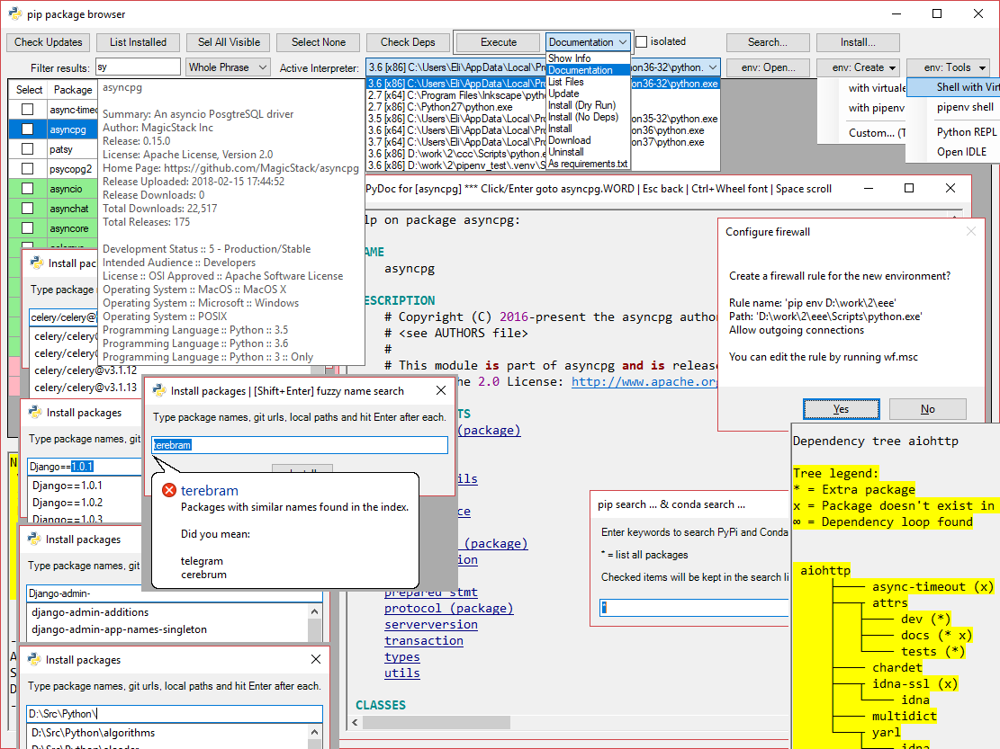

# pips
**pips** is a GUI for pip - Python package manager, written in PowerShell.

This tiny script helps to keep pip packages updated.

1. Refresh to check for updates
2. Choose packages
3. Choose *update* action and execute

